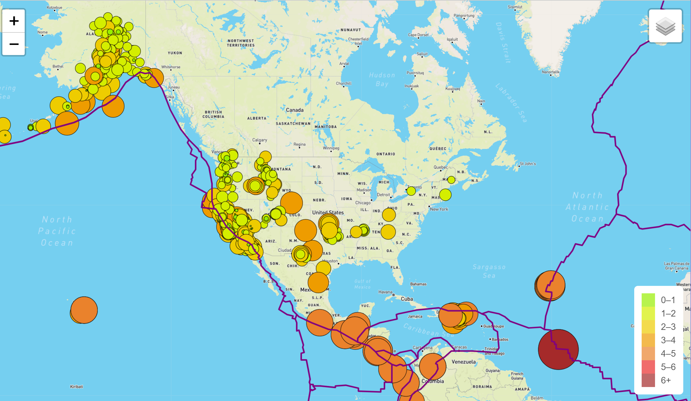
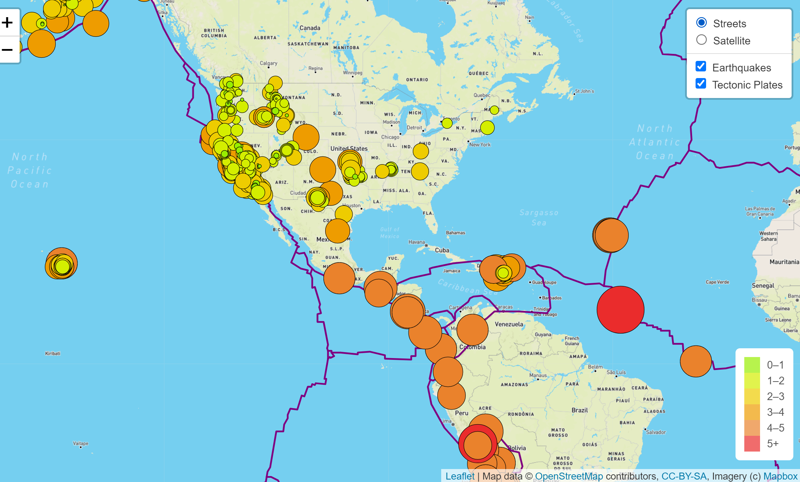
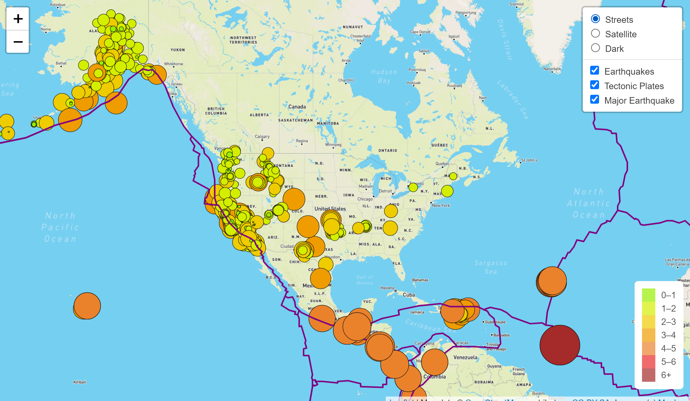
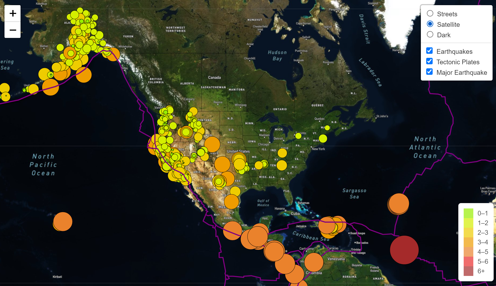
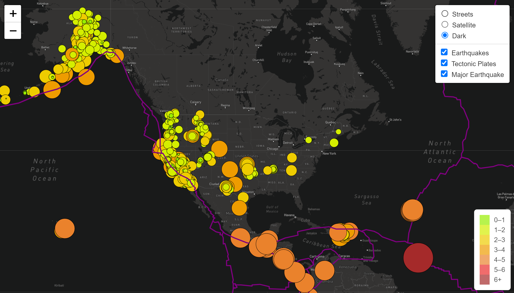
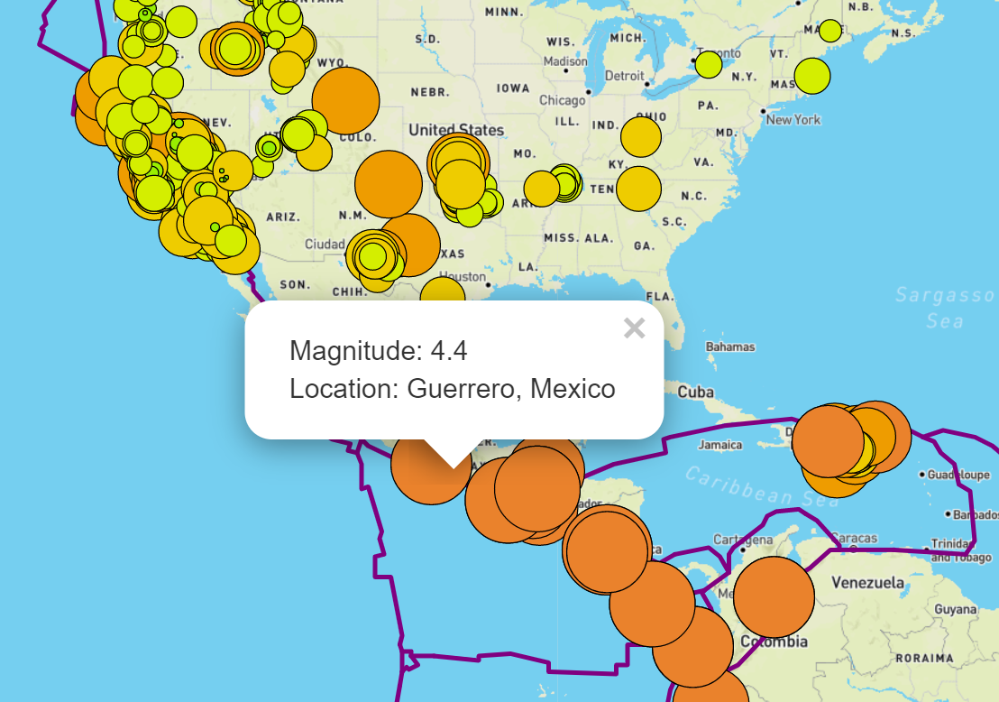

# Mapping Earthquakes

## Overview of the project
Mapping Earthquakes project uses JavaScript and API to peform visualization of earthquake data from the URL. We use Leaflet's library and Mapbox Application Programming Interface(API) to populate a geographical map with GeoJSON earthquake data. Our goal is to map out the Earthquake data that will visually represented by markers, circles,points and lines with colors based on the magnatitude, and create interactivity features to maps.

## Results
Earthquakes datasets are display in our maps. We can see the earthquake data in relation to the tectonic plates' location on the earth, and different magnatitudes levels are visualized in different colors circles. See images below:

Main Page for Earthquakes Map

- Earthquake Maps with Overlay

  - Tectonic Plate and Earthquakes
   
   
  - Major Earthquakes

  

- Tile Layer Styles overview:
  - Satellite

  - Dark
  
 

- Popup Marker (display earthquake information)

## Summary
As we mapping Earthquakes data, each earthquake visually represented by a circle and color. The maps shows a higher magnitude has a larger diameter. Also,it presents a darker color. We create a pop up feature for each earthquake when clicked that will show the magnitude of the earthquake and the location of the earthquake. We successfully create teractive maps using GeoJSON data which can help us to explore earthquakes around the world. 

_____________________________________________________________________________________________________________________________________________________________

- Project Contributor: Phoebe J. Miao
- Email: phoebem2021data@gmail.com
 
